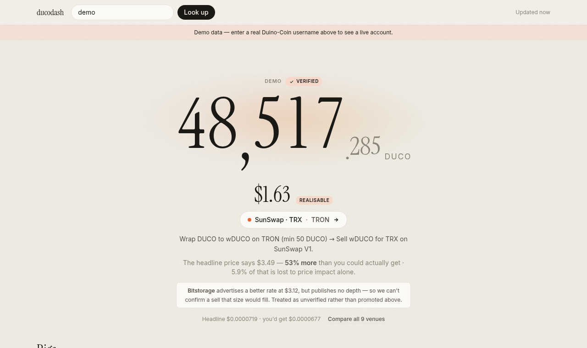

# ducodash

A read-only [Duino-Coin](https://duinocoin.com) wallet dashboard that shows what your
DUCO is **actually** worth.

Type a username, get your balance, your rigs, and a depth-modelled valuation of your
holding. No password, no login, no backend — a static page that talks directly to
public APIs.



## Why

Every DUCO wallet view multiplies your balance by the server's headline
`"Duco price"`. That number is not obtainable. Real liquidity is a few hundred dollars
spread across chains, most venues are dead, and selling any meaningful amount moves
the price hard against you.

Measured live on 2026-08-10, for a 100,000 DUCO holding:

| | |
|---|---|
| Headline price says | **$7.19** |
| Actually realisable | **$4.73** — SunSwap on TRON, after 11.1% price impact and fees |
| PancakeSwap would pay | **$1.13** |

ducodash computes the second number: it reads live pool reserves, simulates the swap
for your exact balance, subtracts network costs, and names the route. Where it can't
verify depth it says so rather than quietly showing a prettier figure.

## What it shows

- **Balance** — a big serif hero number that rolls as it changes.
- **Realisable value** — best route, its deep link, price impact, and the gap to the
  headline price. Every venue ranked, with dead markets marked dead.
- **Rigs** — per-type glyphs for the nine hardware classes the network reports, an
  accepted/rejected share ring and a live hashrate wave per rig. Card density adapts:
  a handful of rigs get large cards, a hundred get a tight grid.
- **Where it came from** — mined vs faucets vs bought vs bridged vs gifts vs lottery,
  and where it went, including burns. Mining income is *derived* (see below).
- **Over time** — best-rate history and a reconstructed balance curve.
- **Transactions** and **network stats**.

## Two things worth knowing about the data

**Mining income is not a transaction.** The server credits mining rewards straight to
the balance row, so it can only be recovered as a residual:
`mined = balance − all inflows + all outflows`. It's labelled as derived, and flagged
when transfers don't reconcile.

**The API returns failures as HTTP 200** with `{"success": false}`. Branching on
`response.ok` accepts error bodies as data — `unwrap()` in `src/api/client.ts` is the
only place that reads the envelope.

## Develop

```bash
npm install
npm run dev            # http://localhost:5173/ducodash/?u=demo
npm test               # unit tests, offline
npm run typecheck
npm run build
npm run shots          # render the demo to shots/ with Playwright
```

`?u=<name>` selects an account and makes the URL shareable. `?mock=1`, or the username
`demo`, runs entirely on fixtures captured from the live API — useful offline, and it
still exercises the real depth model against real captured pool reserves.

There's also a live integration check, skipped by default:

```bash
LIVE=1 npx vitest run src/exchange/live.integration.test.ts --reporter=verbose --silent=false
```

It asserts the simulated pools reproduce the prices the Duino-Coin server independently
reports — which is what catches a wrong decimals constant or flipped reserve ordering.

## Deploy

Pushing to `main` builds and publishes via `.github/workflows/deploy.yml`.

**One-time setup:** repo Settings → Pages → Source = **GitHub Actions**.

The site is a project page at `/ducodash/`; `vite.config.ts` sets `base` to match, and
`BASE_PATH=/ npm run build` overrides it for a user/org site or a local static preview.

## Data sources

All browser-side, all CORS-enabled, no keys:

- `server.duinocoin.com` — balances, rigs, transactions, network stats, price history
- DexScreener — BSC pair discovery and quote-token pricing
- Public BNB Chain RPCs — `getReserves()` for exact depth
- TronGrid — SunSwap V1 reserves and the wDUCO token's decimals
- CoinGecko — TRX in USD

## Licence

AGPL-3.0-or-later.
